```{r setup, include=FALSE}
options(htmltools.dir.version = FALSE)
knitr::opts_chunk$set(
  fig.width=5, fig.height=3, fig.retina=3,
  out.width = "80%",
  cache = FALSE,
  echo = FALSE,
  message = FALSE, 
  warning = FALSE,
  fig.show = TRUE,
  hiline = TRUE
)
```

```{r xaringan-themer, include=FALSE, warning=FALSE}
library(xaringanthemer)
style_mono_light(
  base_color = "#23395b"
)

```

```{r include=F}
library(xaringanExtra)
library(tidyverse)
library(scales)
library(here)
library(readxl)
library(plotrix)
library(viridis)
library(knitr)
library(psych)
library(survey)
library(ggpmisc)
library(wesanderson)
library(gridExtra)
library(gt)

#setwd <- here()
#getwd()
use_panelset()

options(digits=3, scipen=6)

# set default
base <- theme_bw() + theme(panel.grid.minor.x=element_blank(),
                           panel.grid.minor.y=element_blank(),
                           plot.title=element_text(face="bold",size=18, hjust=.5, family = "Source Sans Pro"),
                           plot.subtitle = element_text(size=16, family="Source Sans Pro"),
                           plot.caption=element_text(size=12, family="Source Sans Pro"),
                           axis.title=element_text(size=16, family="Source Sans Pro"),
                           axis.text=element_text(size=14, family="Source Sans Pro"),
                           legend.text=element_text(size=14, family="Source Sans Pro"),
                           strip.text=element_text(size=14, family="Source Sans Pro"),
                           panel.border=element_blank(),
                           axis.ticks = element_blank())

theme_set(base)

faceted <- theme_bw() +
  theme(panel.grid.minor.x=element_blank(),
        panel.grid.minor.y=element_blank(),
        plot.title=element_text(face="bold",size=18, hjust=.5, family = "Source Sans Pro"),
        plot.subtitle = element_text(size=16, family="Source Sans Pro"),
        plot.caption=element_text(size=12, family="Source Sans Pro"),
        axis.title=element_text(size=16, family="Source Sans Pro"),
        axis.text=element_text(size=14, family="Source Sans Pro"),
        legend.text=element_text(size=14, family="Source Sans Pro"),
        strip.text=element_text(size=14, family="Source Sans Pro"))

dat <- read_rds("data/prepared/BPPS prepared.rds")

svydat <- svydesign(data = dat,
                    ids= ~PSU + A9,
                    strata = ~strata,
                    weights = ~Wgt1)

```

```{r include=F}
estBetaParams <- function(mu, var) {
  alpha <- ((1 - mu) / var - 1 / mu) * mu ^ 2
  beta <- alpha * (1 / mu - 1)
  return(params = list(alpha = alpha, beta = beta))
}
```

### Background

Analysts will have background knowledge on their research topic

- familiarity with literature / prior studies

- previous work experience

- other subject matter expertise

---

### Background

A popular way of capturing this knowledge is through the Delphi method: 

- ask experts to estimate some outcome

- show experts the average of the first round of estimates and invite them to revise

- repeat until a general consensus is reached (low variation in estimate revisions)

- take the mean of the revised estimates as 'expert knowledge'

More recently, there have been developments in incorporating expert opinion through Bayesian priors

These priors can be used to communicate expert opinion, but can also be entered directly into empirical analysis

See the [annex](#custom) for an explainer on using the beta distribution 

---

### Bayesian priors - application

We tested the use of Bayesian priors on four survey items, using six experts

.pull-left[
Items

- B1. Aware of USAID
- B4. Positive perception of USAID
- B8. Seen USAID logo
- C12. Use social media
] 

.pull-right[
Experts

- Dan Killian, BPPS Team Lead
- Jacob Patterson-Stein, BPPS Quantitative Analyst
- Melanie Murphy, BPPS Quantitative Analyst
- Carolyn Fonseca, BPPS Qualitative Analyst
- Joseph Schumacher, AMELA Evaluation Lead
- Camille Gockowski, AMELA Deputy Evaluation Lead
] 

Let's see what happened

---

### B1. Aware of USAID

.pull-left[

```{r out.width="150%", fig.align="left"}
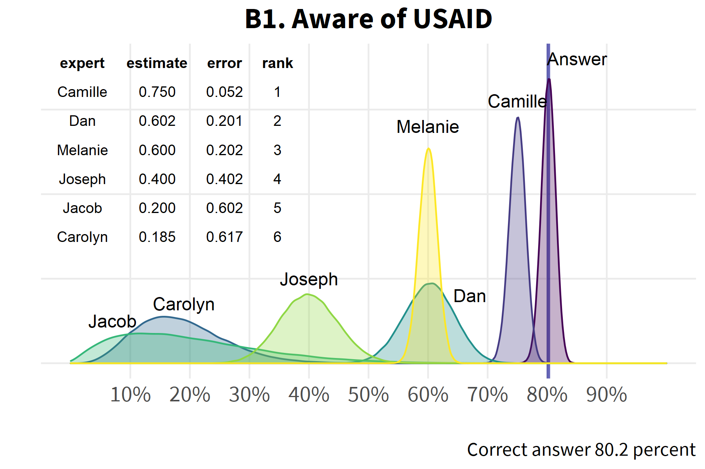
```
]
.pull-right[
```{r out.width="150%", fig.align="right"}
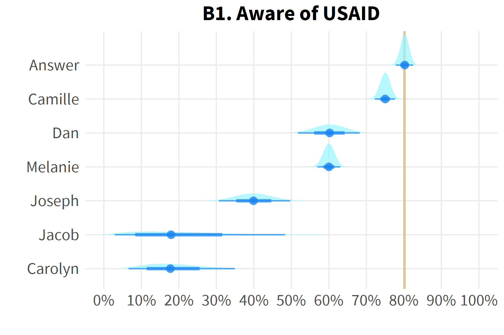
```
]

---

### B4. Positive perception of USAID

.pull-left[

```{r out.width="150%", fig.align="left"}
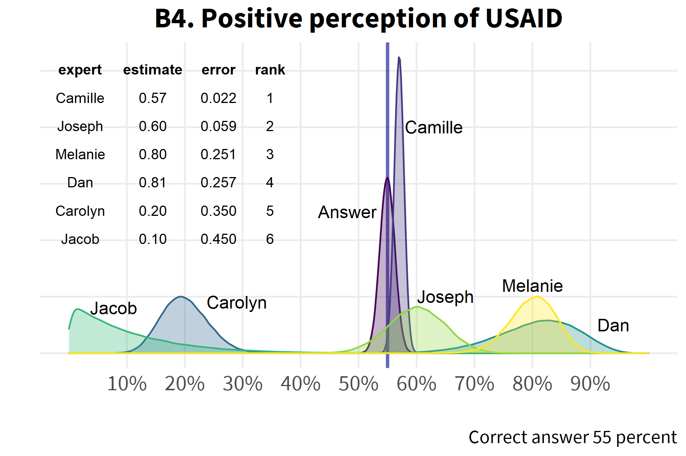
```
]
.pull-right[
```{r out.width="150%", fig.align="right"}
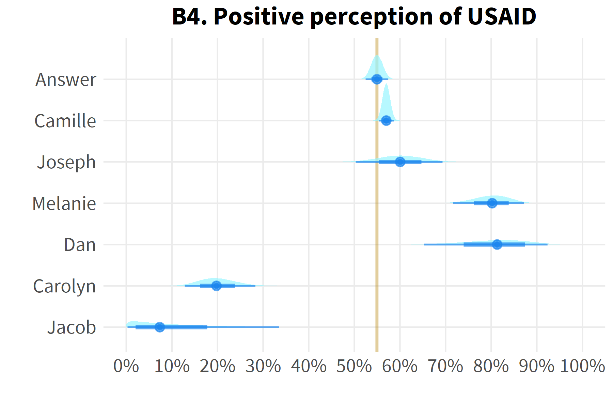
```
]

---

### B8. Seen USAID logo

.pull-left[

```{r out.width="150%", fig.align="left"}
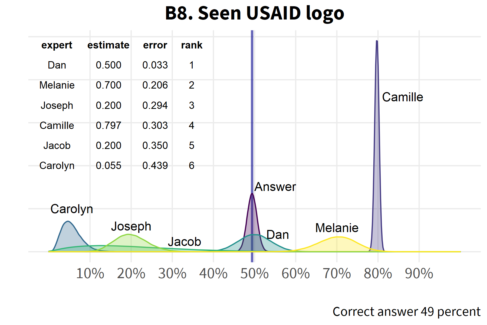
```
]
.pull-right[
```{r out.width="150%", fig.align="right"}
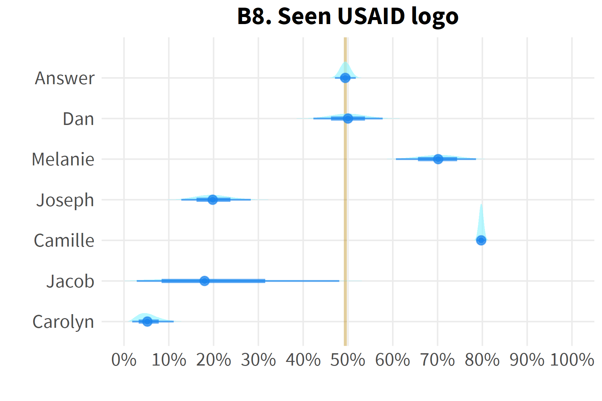
```
]

---

### C12. Use social media

.pull-left[

```{r out.width="150%", fig.align="left"}
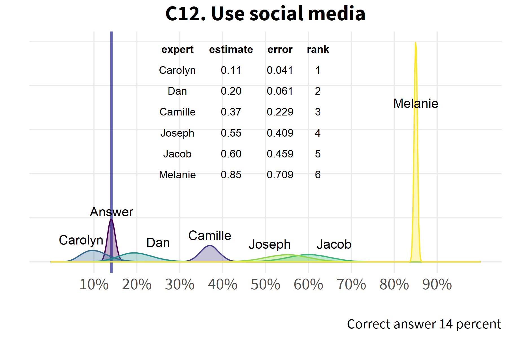
```
]
.pull-right[
```{r out.width="150%", fig.align="right"}
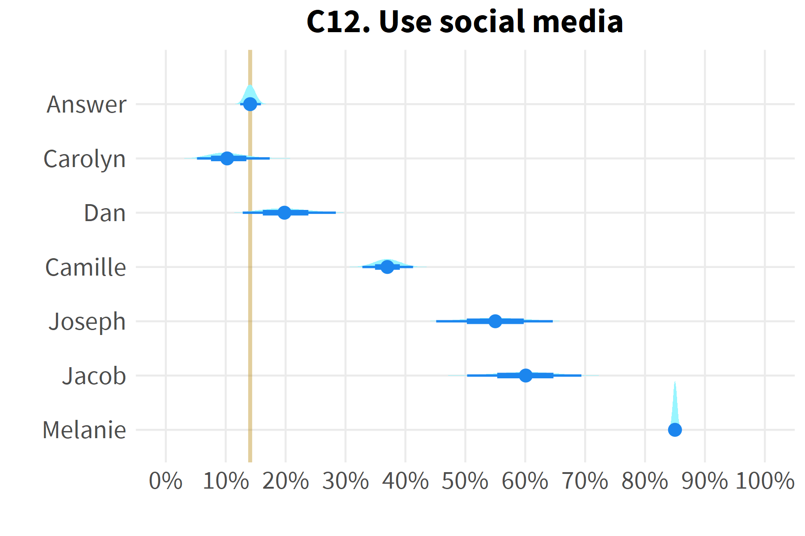
```
]

---

### Average error across all items

```{r out.width="80%", fig.align="center"}
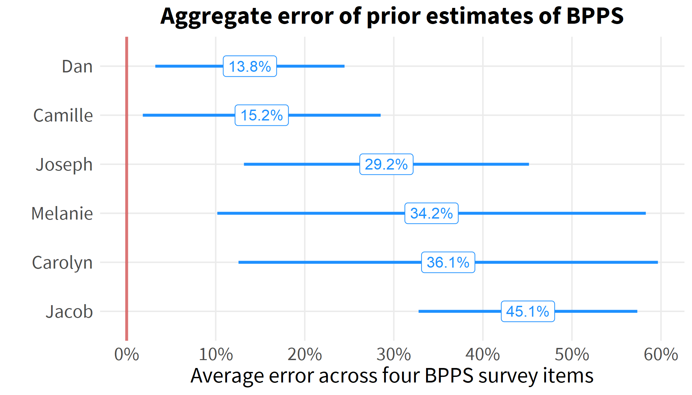
```

---

### Final league table

```{r}
out <- read_csv("output/tables/priors/BPPS priors final league table.csv") 

kable(out,
      col.names=c("Expert","B1","B4","B8","C12","Average rank","Rank of average","Sum of ranks","Rank of sum","Error","Rank of error"),
      align='lccccrcrcrc')
```

Dan and Camille tie for first based on an average or sum of all rankings

Dan wins based on error, but the margin is miniscule and statistically it's still a tie

---

### Thoughts

This was just a demonstration

Could it be a worthwhile exercise internally? With other stakeholders? 

Could it engender learning? Inform adaptive programming? 

Could we try a few cases, document what we learned, and enter into next year's CLA case competition? 

---

class: center, middle

## Thank you!

---

### Annex: using the beta distribution

For an outcome that is some proportion of a total such as "50 percent believe X", we use the beta distribution

The beta distribution is a distribution of proportions (between zero and one) governed by two parameters alpha $(\alpha)$ and beta $(\beta)$

The draw x from a beta distribution of proportions is defined as $x=\frac{\alpha}{\alpha+\beta}$

- $\alpha$ is the number of 'successes'
- $\beta$ is the number of 'failures'

So for example, for $\alpha$ = 5 and $\beta$ = 5, we have $x=\frac{5}{5+5}=\text{50%}$

In an effort to bring some intuition to this, you could consider $\alpha + \beta$ to be the sample size of your prior estimate, such that a higher sample size makes your estimate more precise. 

So for $\alpha$ = 5 and $\beta$ = 5, we have a prior sample size of 10 

For $\alpha$ = 50 and $\beta$ = 50, we have a prior sample size of 100 

---

Take a look at beta distributions for (i) $\alpha$ = 5, $\beta$ = 5, and (ii) $\alpha$ = 50, $\beta$ = 50: 

.pull-left[

```{r out.width="150%", fig.align="left"}
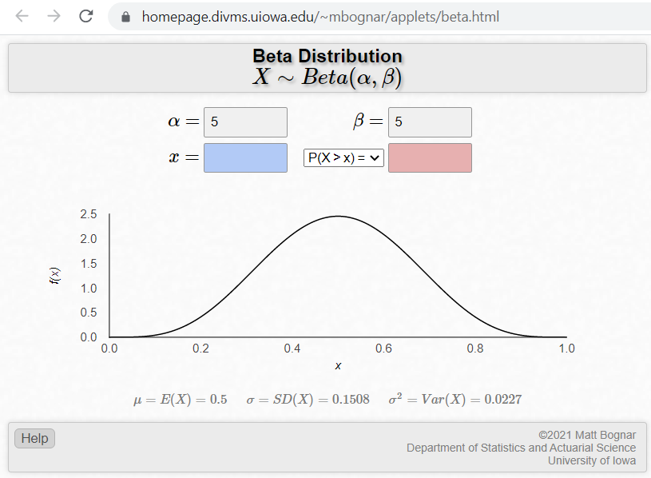
```
]
.pull-right[
```{r out.width="150%", fig.align="right"}
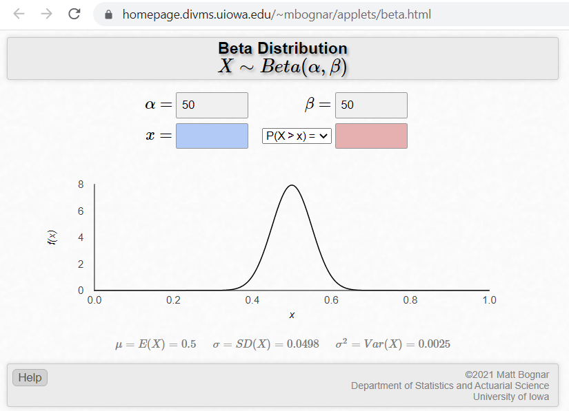
```
] 

Note that the beta distribution curve follows the shape we would expect, based on a higher or lower prior sample size. 

Try out your own values of $\alpha$ and $\beta$ 

Beta distribution applet: [https://homepage.divms.uiowa.edu/~mbognar/applets/beta.html](https://homepage.divms.uiowa.edu/~mbognar/applets/beta.html) 

---

### Bayesian priors on a proportional outcome

We can also explore our chosen beta distributions through simulation. First, prepare the data. 

```{r echo = T}
args(rbeta)
```

shape1 is alpha 

shape2 is beta

```{r echo=T}
set.seed(54932)

x1 <- rbeta(1000, 5,5)   # Prior sample size of 10
x2 <- rbeta(1000, 50,50) # Prior sample size of 100

x <- data.frame(x1,x2)
```

---

### Beta distribution for two sets of parameters

```{r fig.align="center"}

ggplot(x) + 
  geom_density(aes(x2), 
               color="firebrick2", 
               fill="pink", 
               size=.8, 
               alpha=.4) +
  geom_density(aes(x1), 
               color="dodgerblue", 
               fill = "lightblue", 
               size=.8, 
               alpha=.4) +
  labs(x="",
       y="",
       caption="Prior sample size of 10 (blue)
       Prior sample size of 100 (red)")  +
  scale_y_continuous(labels=NULL) +
  annotate("text", x=.345, y=1.3, 
           label="alpha==5", parse=T) +
  annotate("text", x=.345, y=.7, 
           label="beta==5", parse=T) +
  annotate("text", x=.5, y=5, 
           label="alpha==50", parse=T) +
  annotate("text", x=.5, y=4.2, 
           label="beta==50", parse=T)

```

---

### How do we assess the accuracy of one prior relative to another?

Each draw from the distribution can be considered a sample mean

So we take a random draw from the prior distribution and a random draw from the sampling distribution of the survey mean. The difference between these values is our error.  

The mean of all error measurements gives us an overall measure of error for each expert. The expert with the lowest error is considered to have a better prior than others. 
 
---
 
### Converting the survey mean to a beta distribution

In order to measure the error between a prior distribution and the sampling distribution of the survey mean, we need to convert the mean and variance of the survey statistic into a beta distribution. 

It can be [shown](https://stats.stackexchange.com/questions/12232/calculating-the-parameters-of-a-beta-distribution-using-the-mean-and-variance) that the mean and variance of a proportion relate to $\alpha$ and $\beta$ as follows: 

$$\alpha=\left(\frac{1-\mu}{\sigma^2}-\frac{1}{\mu}\right)\mu^2$$
$$\beta=\sigma\left(\frac{1}{\mu}-1\right)$$
These calculations are captured in the following function: 

```{r echo=T}
estBetaParams <- function(mu, var) {
  alpha <- ((1 - mu) / var - 1 / mu) * mu ^ 2
  beta <- alpha * (1 / mu - 1)
  return(params = list(alpha = alpha, beta = beta))
}
```

We now use this function to generate a beta distribution from our survey statistic

---
 
### Assessing the accuracy of priors - example

```{r echo=T}
b1_mn <- svymean(~aware,
        na.rm=T,
        deff="replace",
        design=svydat)
b1_mn
```

```{r echo=T}
b1_ans <- data.frame(expert="Answer",
                     item="B1",
                     x=rbeta(1e5,
                             estBetaParams(.802, .0118^2)$alpha,
                             estBetaParams(.802, .0118^2)$beta)) %>%
  mutate(diff = abs(x-b1_mn))
b1_ans[1:3,]
```

---

Let's compare this to one of the expert's prior distribution

```{r echo=T}
b1_cam <- data.frame(expert="Camille",
                     item="B1",
                     x=rbeta(1e5,750,250)) %>%
  mutate(diff=abs(x - b1_ans$x))

b1_cam %>%
  summarize(error=mean(diff),
            se = sd(diff))
```

The mean error is five percent, which is the same as if we had simply taken the difference between the survey mean and the prior mean. 

By taking a simulation-based approach, we also get a measure of the dispersion of the error - in this case, the error is 5.2 percent with a standard deviation of 1.8 percent. 


